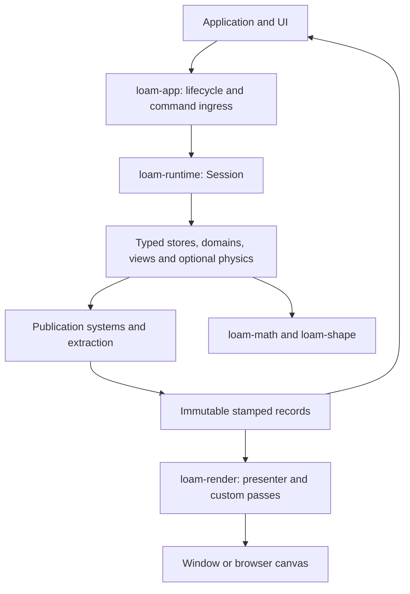

# Architecture

Loam separates simulation, presentation, and the platform host. `Space` defines
geometry inside typed domains and numerical kernels. An application supplies its
content, rules, controls, and UI.

## Crate boundaries

The manifests define the dependency graph. Math and shape do not depend on the
runtime, renderer, or host.

| Crate | Responsibility |
|---|---|
| `loam-math` | Spaces, frames, isometries, rotors, projections, and geometry WGSL |
| `loam-shape` | Shapes, topology, sections, isovolumes, and distance-field contracts |
| `loam-scene` | CSG scenes, CPU evaluation, loading, edits, and WGSL emission |
| `loam-time` | Fixed steps, traces, replay data, timelines, and the parallel shim |
| `loam-physics` | Bodies, collision, contacts, constraints, and world snapshots |
| `loam-runtime` | Typed storage, entities, commands, domains, views, and CPU publication |
| `loam-render` | GPU resources, pass ordering, shared depth, raster, and raymarch rendering |
| `loam-text` | Glyph overlays, extruded letter geometry, and text rendering |
| `loam-console` | Console model and logging |
| `loam-egui` | Debug UI and console integration |
| `loam-app` | Native and browser lifecycle, input transport, files, capture, and pacing |
| `loam` | Crate aliases and a prelude with feature-selected APIs |

The facade's default features support headless use. `render`, `app`, `physics`,
`text`, and `capture` opt into their corresponding dependencies. Apps can also
depend on engine crates directly.

## Session and commands

`Session<A>` owns application state, domains, views, entities, and pending
commands. `stores!` derives storage support from `Store<T>`, `Value<T>`, and
relation fields. Stores provide sparse lookup, dense iteration, disjoint borrows,
and bounded change logs.

Systems run in registration order within `Dispatch`, `Simulation`, and
`Publication`. `system_at` places a system around a named entry such as
`DOMAIN_STEP`. A boundary commits deferred commands, then runs each Dispatch
system and its commands. Fixed steps run Simulation systems. Publication systems
derive display data before extraction stamps it.

Checked spawn rolls back a failed attachment. Every accepted command has an
ordered result. An `AppCommand` can mutate state before returning an error;
the runtime does not roll back arbitrary callback code. Compound app actions
must validate their edits before applying them.

A failed CPU phase blocks further steps, publication, and snapshots. Reset or a
valid restore clears the fault. Restore validates domains before replacing state,
cancels pending commands, and advances the entity epoch. Old handles no longer
resolve. Runtime and epoch identities stop at exhaustion instead of wrapping.

## Geometry and pose ownership

`Domains::read` provides shared typed access; `Domains::typed` provides mutable
access. Erasure occurs at the domain boundary. Numerical loops retain their
concrete `Space` type.

A pose contains a point and a frame orthonormal in that point's metric.
`DomainSpace` does not require an isometry group. `Homogeneous`, `WgslSpace`, and
`PhysicsSpace` express separate capabilities. Chart values cross the erased
boundary through checked conversions. Curved operations can refuse an invalid
chart, a numerical failure, or an exceeded error budget.

Pose storage is private. Checked edits route through the owning facility.
Physics owns body poses and synchronizes dirty rows at runtime cutoffs.
Free objects use the domain's checked pose operations. Sleeping bodies do not
rewrite unchanged rows.

Views map domain geometry into image spaces. Rigid placements compose toward
the root. A bridge links a source view to an anchor and removes the placement
when either endpoint despawns. This is not a general atlas implementation.
Picking compares hits in root-eye projective depth. Manipulation retains the
picked source view and its lifted hit through a drag.

## Publication and rendering

Each published view contains stamped instance, segment, and triangle records.
Change cursors preserve an unchanged view's built stamp. The presenter uses that
stamp to skip redundant uploads. Changed views can rebuild their full records;
dense storage does not imply incremental work per changed object.

Each view counts explicit geometry refusals and retains the first and last
entity, error, and source. Normal projection clipping is not a refusal.

`Records` prevents publication into a buffer that a consumer still holds.
Failed extraction clears the attempted publication and faults the session.
The host does not render a partial buffer. Fill callbacks receive shared session
and publication references. UI actions enter a later command boundary.

Raster and raymarch passes share projective depth and negotiated frame formats.
The pass schedule validates resource ordering and depth compatibility. Custom
native passes remain available. Renderer resources rebuild after device loss
without a GPU simulation checkpoint protocol.

Playground's SDF rendering uses `Scene4` and `HyperslicePass`. The separate
dynamic field renderer is removed. WGSL assembly and validation operate on source
strings; file ownership belongs to the host. CPU field programs retain bounded
evaluation, conservative field kinds, and their spatial index. Their compiler
supports the existing Euclidean chart representations. CPU field queries do not
require a shader prelude. The geodesic march kernel has its own ABI and limits.

## Host and application boundary

The launch factory builds application state after native or browser options
resolve. The browser page launches a worker without constructing a discarded
session. The worker receives the canvas and URL options. The session owns the
simulation configuration.

The host gathers input, admits commands, runs fixed steps, publishes, and fills
the renderer and UI. UI and console share bounded command ingress. The console
owns parsing and text responses. Input remains available through all fixed steps
for that frame. Pointer release and cancellation clear existing gestures even
when UI consumes the event.

After a session fault, the host keeps the last uploaded scene and console alive.
It suspends application fill and simulation time until reset or restore succeeds.
Device and host failures follow their platform recovery or shutdown paths.

Native execution supplies windows, devices, files, and capture. The browser host
uses WebGPU and an offscreen canvas in a worker. Parallel kernels use
`loam_time::par`; the browser executes the same kernels on one thread. Native apps
can use capabilities unavailable to a browser build.

Playground owns its modes, catalog, row order, colors, filmstrip, Toybox tuning,
and UI layout. Hero owns its geometry composition and sequence. The engine owns
their shared hosting, commands, camera controls, manipulation, and rendering
mechanisms. The frame-script driver schedules console commands for captures;
it is not a Rhai VM.

## Limits and verification

GPU-authoritative simulation, CPU/GPU checkpoint pairing, and simulation/render
overlap are deferred. The runtime executes synchronous CPU systems. Dense
storage and joined kernels remain available for larger workloads.

Warm storage, extraction, and physics paths reuse capacity. Boxed app actions
and UI code still have allocation costs. Measurements in [PERF.md](PERF.md)
describe their recorded versions, including renderer paths since removed.

Focused tests cover identity, ordering, failure recovery, pose ownership,
geometry, and allocation behavior. Interactive checks cover demo controls and
appearance. CI owns the full native platform matrix, browser builds, formatting,
linting, rustdoc, and GPU probes. Local checks follow repository policy and do not
replace CI.
